# Apache Web Server

## Objective

Host a personal webpage on the Linux lab server, check HTTP access, configure the firewall, and test how stopping and starting Apache affects access.

## Environment

| Item | Evidence |
| --- | --- |
| Server | Linux Mint guest shown in Oracle VM VirtualBox |
| Package sources | Linux Mint `zena` and Ubuntu `noble` repositories |
| Hostname | `WEB-01` |
| Linux user | `steady` |
| IPv4 address | `192.168.1.31`, shown by `hostname -I` |
| Web server | Response header reports `Apache/2.4.58 (Ubuntu)` |
| Apache package | APT reports `2.4.58-1ubuntu8.15` in the added installation check |
| Webpage file | `/var/www/html/index.html` |
| Tools shown | APT, systemctl, curl, UFW, GNU nano 7.2, SSH, Windows PowerShell, and a browser |

The captures cover September 16, September 20, and September 23, 2026. The exact Linux Mint release number and VirtualBox version are not shown. The added Apache installation command confirms that the package was already installed; the original package installation is not captured.

## Procedure

The Apache installation check is placed after the package update to keep setup steps together. Its screenshot was captured later, on September 23. The remaining steps follow the visible command history and capture sequence; capture time is not always command execution time.

### 1. Set the hostname and update package lists

```bash
sudo hostnamectl set-hostname WEB-01
hostname
hostname -I
sudo apt update
```

`hostname` returned `WEB-01`. The address output included `192.168.1.31` and IPv6 addresses. APT downloaded repository metadata; the next capture shows the update completed with 436 packages available for upgrade. No package upgrade is shown.

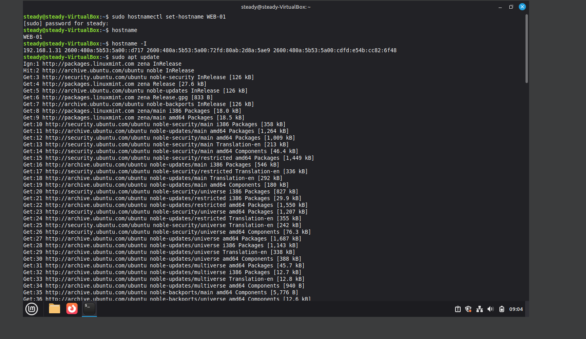

### 2. Run the Apache installation command and confirm the package

The added capture, dated September 23 in its original filename, shows this command on `WEB-01`:

```bash
sudo apt install apache2
```

APT completed its package checks and reported:

```text
apache2 is already the newest version (2.4.58-1ubuntu8.15).
0 upgraded, 0 newly installed, 0 to remove and 439 not upgraded.
```

This confirms that Apache was installed and that APT considered it the newest available version at the time of this check. No packages were installed or upgraded by this command. The capture does not show the original installation or verify that the Apache service was running.

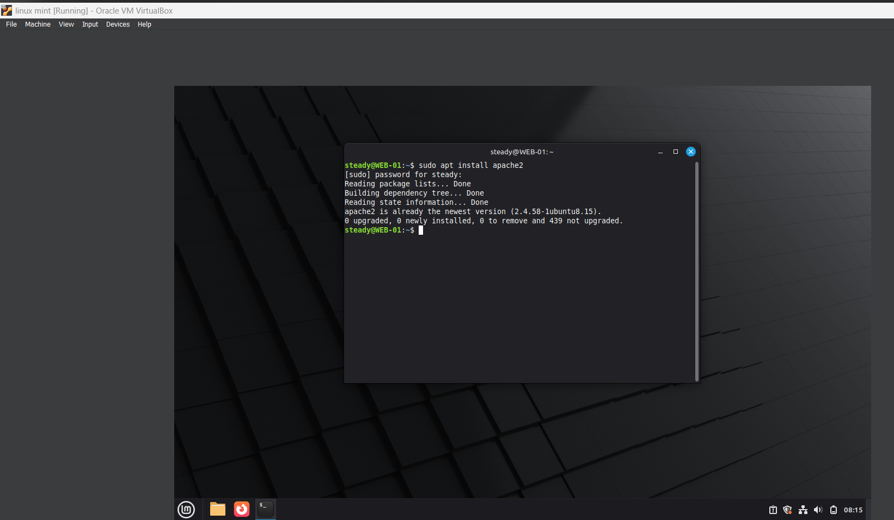

### 3. Check SSH service access

An OpenSSH installation attempt contained a spelling mistake:

```bash
sudo apt intall openssh-server -y
```

APT displayed its help text. This does not establish a successful OpenSSH installation.

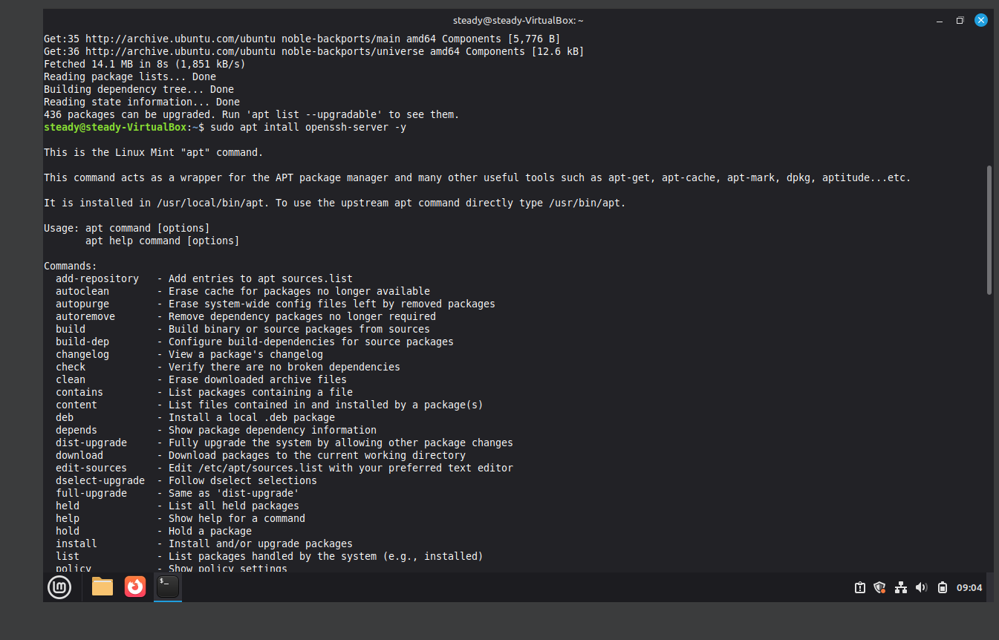

The first start command also contained a typo. The corrected commands followed it:

```bash
sudo sytemctl start ssh
sudo systemctl start ssh
sudo systemctl enable ssh
sudo systemctl status ssh
```

The misspelled command returned `command not found`. The later status showed SSH enabled and `active (running)`. The service was already available; its displayed start time predates these captures.

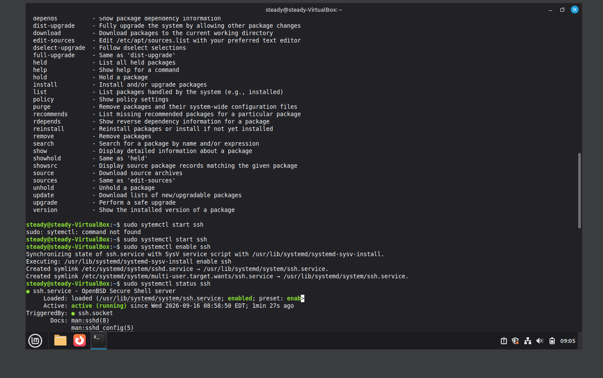

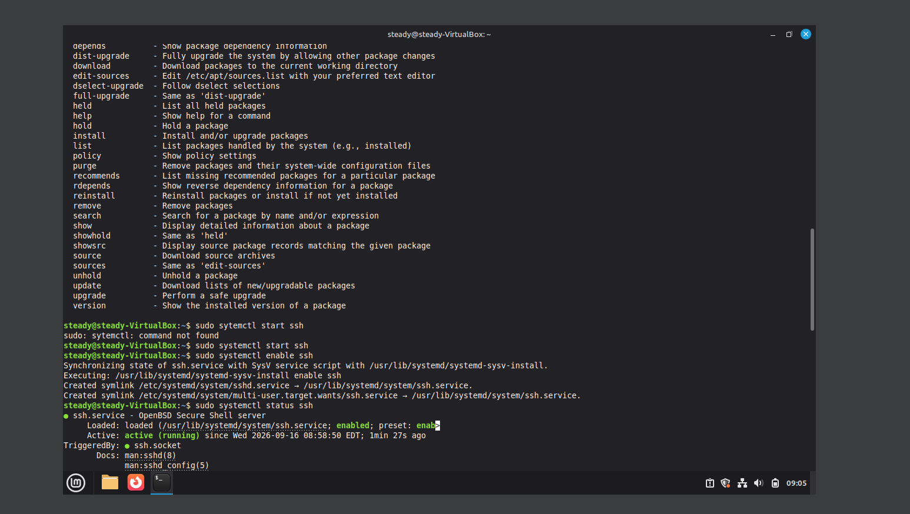

Further status views showed SSH listening on `0.0.0.0` and `::`, port 22.

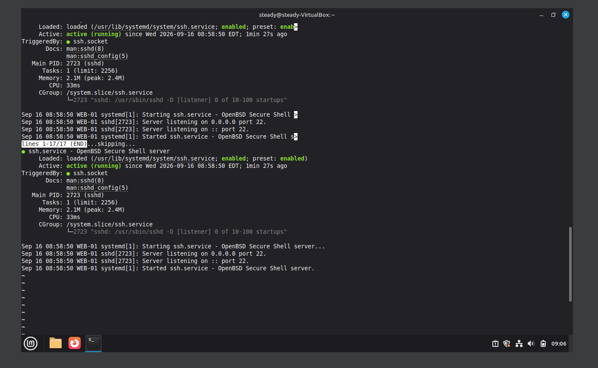

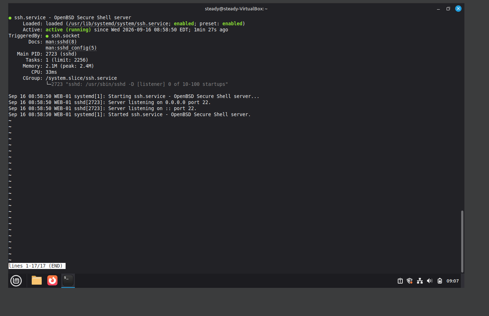

### 4. Check the local HTTP response and view the personal webpage

The terminal history preserved in screenshot 11 includes:

```bash
curl -I http://localhost
```

It returned `HTTP/1.1 200 OK`, `Server: Apache/2.4.58 (Ubuntu)`, and `Content-Type: text/html`. Its response date is 13:16:41 GMT, earlier than the browser capture below. [See the HTTP headers in screenshot 11](screenshots/11-http-headers-and-ufw-configuration.png).

The browser displayed the personal webpage at `192.168.1.31`. It included “Hi, I'm Eddie”, “Linux & Server Administration”, and a reference to server `WEB-01`. This confirms that the page loaded in that capture. The page's own “Apache is running successfully” text is page content, rather than an independent service check.

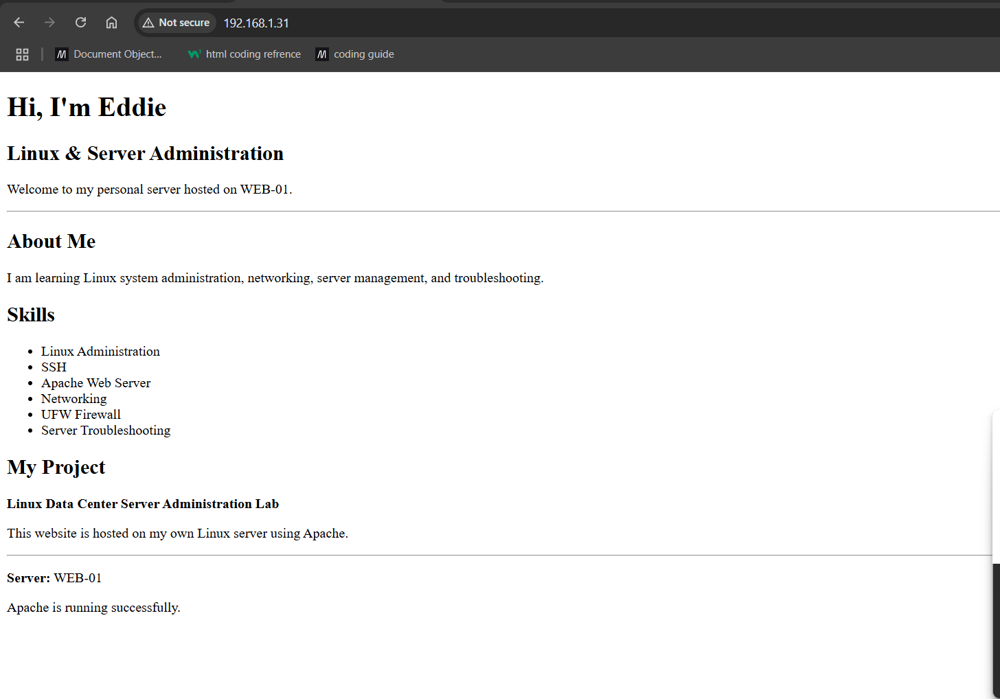

### 5. Open the webpage source in nano

The terminal history shows:

```bash
sudo nano /var/www/html/index.html
```

The nano capture shows the file open with the title `Eddie | Linux Server`, headings, paragraphs, and a list of skills. Nano reports that it read 58 lines. The screenshot confirms the file and visible HTML; it does not show the original creation command or a save operation. The browser capture above was taken before this editor capture.

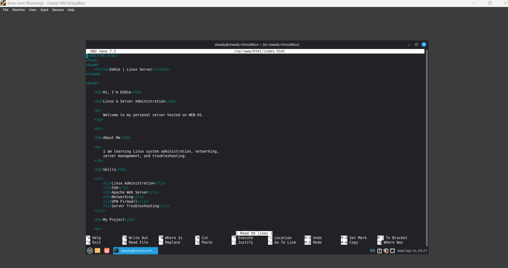

### 6. Configure and enable UFW

```bash
sudo apt install ufw -y
sudo ufw allow OpenSSH
sudo allow Apache
sudo ufw allow Apache
sudo ufw enable
sudo ufw status
```

APT reported that UFW `0.36.2-6` was already the newest version. `sudo allow Apache` failed because `allow` was not found. The next command included `ufw` and updated the rules.

UFW then reported that the firewall was active and enabled on system startup. Its status listed `OpenSSH` and `Apache` as allowed from anywhere for both IPv4 and IPv6.

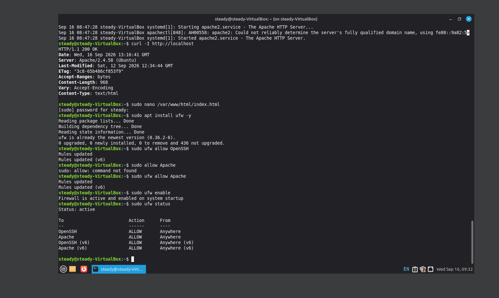

### 7. Stop Apache, check the failure, and start it again

```bash
sudo ufw status
sudo systemctl stop apache2
curl -I http://localhost
sudo systemctl status apache2
sudo systemctl start apache2
curl -I http://localhost
```

After Apache was stopped, curl failed to connect to localhost on port 80. The service status showed `inactive (dead)` and an enabled unit. After the start command, curl returned `HTTP/1.1 200 OK` again. This records a successful recovery during the September 16 test.

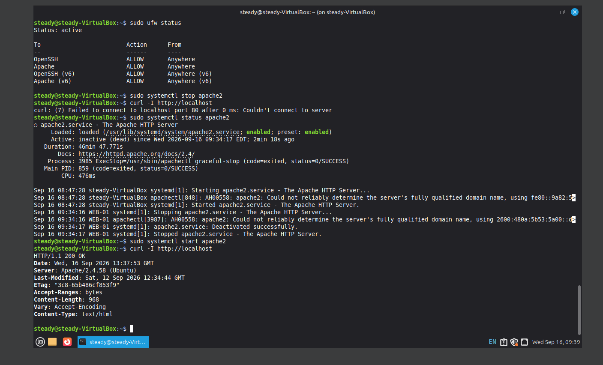

### 8. Log in from Windows using SSH

In Windows PowerShell:

```powershell
ssh steady@192.168.1.31
```

After login, the Linux command was:

```bash
hostname
```

The remote prompt showed `steady@WEB-01`, and `hostname` returned `WEB-01`.

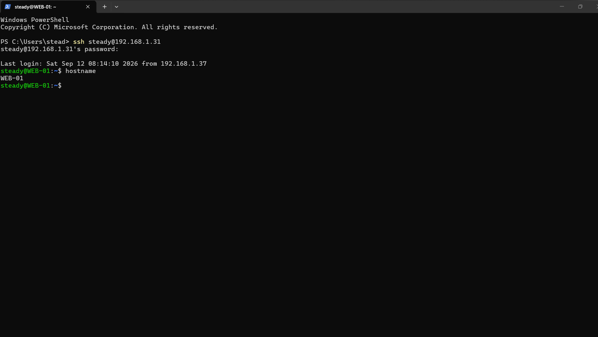

### 9. Record later access failures

The September 20 browser captures show the same server address. The first includes an error icon but no readable error explanation. Two further crops show the address bar only; they do not establish whether the webpage loaded.

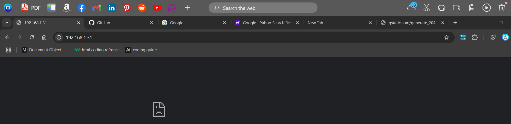

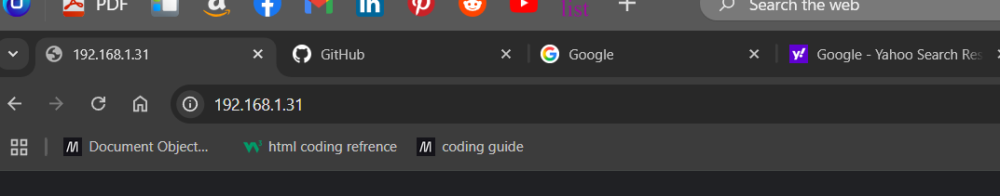


The full error capture says that `192.168.1.31` took too long to respond and reports `ERR_CONNECTION_TIMED_OUT`.

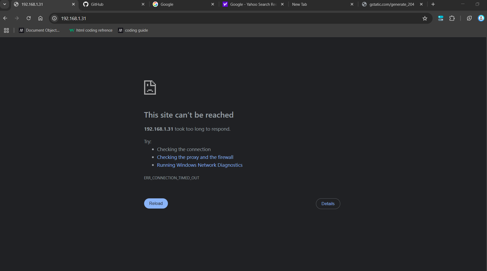

The later terminal capture shows:

```bash
hostname -I
sudo systemctl stop apache2
curl http://localhost
sudo ss - tlnp | grep :80
```

The IPv4 address was still `192.168.1.31`. After the stop command, curl could not connect to localhost port 80. The `ss` command is reproduced as typed, including the space after `-`; it returned an address-parsing error rather than a listener list. No subsequent correction or recovery is shown.

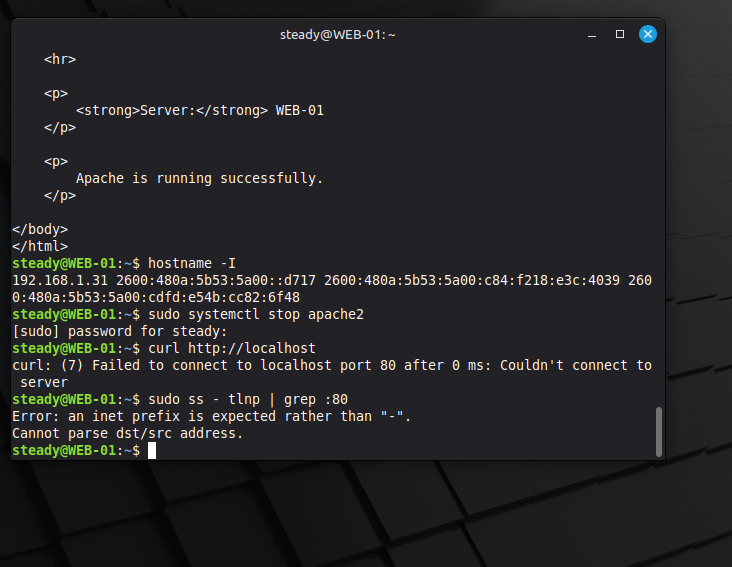

## Configuration

- The hostname was set to `WEB-01`.
- `/var/www/html/index.html` contained the personal webpage shown in nano. Only part of the source is visible.
- UFW was active with `OpenSSH` and `Apache` allow rules for IPv4 and IPv6.
- Apache's service unit was enabled in the recorded status output. The command used to enable it is not shown.
- No Apache virtual-host file, `ServerName` setting, TLS configuration, or network adapter configuration is visible.

## Verification

- `hostname` and `hostname -I` established the recorded server name and address.
- SSH status showed the service running and listening on port 22; a Windows SSH login succeeded.
- `curl -I http://localhost` returned HTTP 200 and an Apache response header on September 16.
- The browser loaded the custom webpage at `192.168.1.31` on September 16.
- `sudo ufw status` showed the firewall active with the recorded rules.
- Stopping Apache caused a local HTTP connection failure; starting it restored HTTP 200 in the September 16 test.

- `sudo apt install apache2` confirmed the installed package version `2.4.58-1ubuntu8.15` in the added September 23 capture.

The September 20 captures include later failures. The September 23 package check confirms installation but does not demonstrate a final successful HTTP recovery.

## Troubleshooting

| Issue shown | Observed outcome |
| --- | --- |
| `apt intall` typo | APT help appeared. A corrected installation is not shown. |
| `sytemctl` typo | Command not found; the following `systemctl` commands worked. |
| Missing `ufw` in `sudo allow Apache` | Command not found; `sudo ufw allow Apache` updated the rules. |
| Apache stopped on September 16 | Local curl failed and status was inactive. Starting Apache restored HTTP 200. |
| Apache `AH00558` warning | Logs said the server's fully qualified domain name could not be reliably determined. No configuration fix is shown; HTTP checks still succeeded on September 16. |
| September 20 browser timeout | `ERR_CONNECTION_TIMED_OUT` was displayed. Its cause and resolution are not established. |
| September 20 local HTTP failure | It followed an explicit Apache stop command. No restart is visible. |
| `sudo ss - tlnp \| grep :80` | An address-parsing error appeared. No successful socket check is shown. |

The later terminal stop command does not establish the cause of the earlier browser timeout.

## Skills Demonstrated

- Setting and verifying a Linux hostname.
- Checking server IP addresses and updating package lists.
- Running the Apache installation command and interpreting APT's installed-package result.
- Managing services and reading systemctl status output.
- Accessing a Linux server through SSH from Windows.
- Working with an HTML webpage in nano.
- Checking HTTP response headers with curl and viewing a page in a browser.
- Configuring and checking UFW application rules.
- Testing Apache availability through stop/start commands and identifying command errors.

## Evidence Notes

All 20 supplied PNG files are preserved without changing their contents. Filenames are numbered in original capture order. [The evidence inventory](evidence-inventory.csv) records each original filename, new filename, image dimensions, and SHA-256 hash. Hashes were checked after moving and renaming the files.

Three supplied images contain no readable practical evidence. They are retained here as links rather than enlarged images:

- [07: unreadable crop, 8 × 1 pixels](screenshots/07-unreadable-crop-092158.png)
- [08: unreadable crop, 537 × 7 pixels](screenshots/08-unreadable-crop-092214.png)
- [13: unreadable crop, 1 × 28 pixels](screenshots/13-unreadable-crop-094528.png)

The screenshots do not show the original Apache package installation, full webpage source, exact timing of every edit, static IP configuration, or the cause and resolution of the later browser timeout. These details have not been reconstructed.
